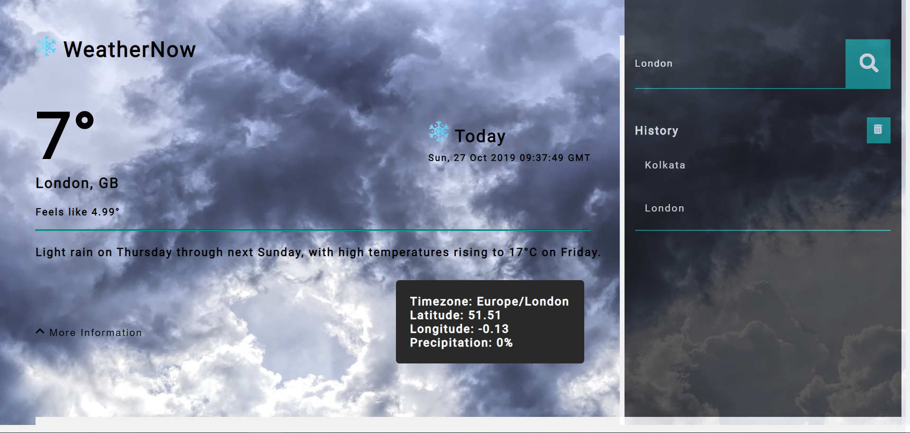
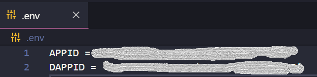

# WeatherNow - A Weather Web App Using Angular and NodeJS (Full Stack)

It is a simple web app which shows the current weather details of any city entered. It uses both DarkSkyAPI and OpenWeatherMapAPI to fetch the informations. The app also displays the weather information about the next 7 days of the city entered. The front-end is made using Angular and all the API calling is done at back-end using Node and Express as the server.

# Pre-requisites

    1. Must have NodeJS installed in your system.
    2. Create an account at DarkSkyAPI and OpenWeatherMapAPI, and generate the API key required for the app to run.

# Setup

    1. In the root folder, create a file with name '.env'.
    2. In that file type APPID = 'Your OpenWeatherMapAPI key'.
    3. In the next line of the same file, type DAPPID = 'Your DarkSkyAPI key'.

Your '.env' file should look like this below :-

# Usage

    1.  Install NodeJS on your device to run this project.
    2.  Clone the repository at https://github.com/Cshayan/Weather-App-Using-Angular-And-NodeJS.git
    3.  Open the root folder in any terminal.
    4.  Type npm install to install all the dependencies.
    5. Type npm install -D nodemon to install nodemon.
    6.  Move to the folder angular_frontend/weather-app from the root folder. Type cd angular_frontend/weather-app.
    7.  Run npm install. It will install the dependencies for Angular front-end

# Run Back-end

    1. Go to the root folder. After following all the above steps mentioned, simply type nodemon in the terminal. This will
    start the back-end server at port 3000.

# Run Front-end

    1. Navigate to cd angular_frontend/weather-app. Type ng serve -o. Wait for sometime and this will start the Weather App in your browser at port 4200.
